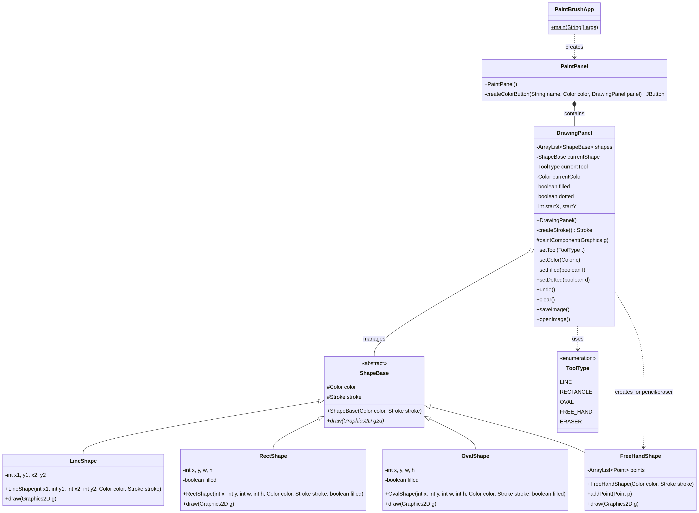
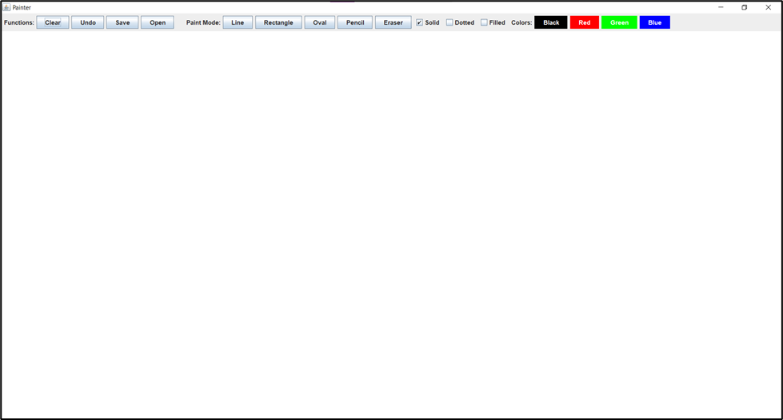

# Java Painter Application

A simple, yet functional, graphical editor built using Java Swing. This application allows users to draw basic shapes (lines, rectangles, ovals), use freehand tools (pencil, eraser), and manage their drawings with features like save, open, clear, and undo.

## 🎨 Features

*   **Drawing Tools**: Line, Rectangle, Oval, Pencil, and Eraser.
*   **Shape Customization**: Control color, stroke style (solid/dotted), and fill state (filled/outline).
*   **File Management**: Save the current drawing as an image (PNG) and open existing images.
*   **State Management**: Undo the last drawn shape and clear the entire canvas.

## 🚀 Getting Started

### Prerequisites

*   Java Development Kit (JDK) 8 or newer.

### Running the Application

1.  **Clone the repository:**
    ```bash
    git clone [YOUR_REPOSITORY_URL]
    cd Java-Painter-Application
    ```
2.  **Compile the source code:**
    The main source files are located in the `src/paint` directory. You can compile them using your IDE (Eclipse, IntelliJ, VS Code) or the command line.
    ```bash
    # Example command line compilation (from the root directory)
    javac -d bin src/paint/app/PaintBrushApp.java src/paint/ui/*.java src/paint/model/*.java src/paint/tools/*.java src/paint/exception/*.java
    ```
3.  **Run the application:**
    ```bash
    java -cp bin paint.app.PaintBrushApp
    ```

## 📐 Project Structure

The project follows a clean, package-based structure:

```
Java-Painter-Application/
├── src/
│   └── paint/
│       ├── app/          # Main application entry point
│       ├── exception/    # Custom exception handling
│       ├── model/        # Data model for all drawable shapes
│       ├── tools/        # Enumeration for tool types
│       └── ui/           # User Interface components (DrawingPanel, PaintPanel)
├── docs/                 # Comprehensive documentation and analysis
├── assets/               # Images, diagrams, and GUI samples
└── README.md             # This file
```

## 📖 Comprehensive Documentation

A detailed technical analysis of the application's architecture, class hierarchy, and functionality is available in the `docs/` folder.

*   **[Documentation (Markdown)](./docs/documentation.md)**
*   **[Documentation (PDF)](./docs/documentation.pdf)**

### UML Class Diagram

The core class relationships are visualized in the UML diagram below:



### GUI Sample

A screenshot of the application's main window:



## ✍️ Author

*   **Manus AI** (Documentation and Repository Preparation)
*   *Original Author Name Here* (Please replace with the original author's name)
